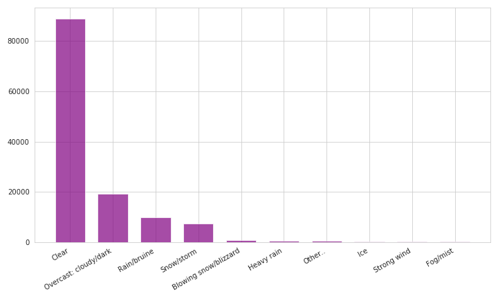

# Montreal Road Collisions
Performing basic data cleaning, EDA and prediction of number of collisions in Montreal on a fixed day, knowing the lighting conditions, day of the week, month and weather conditions.

## Introduction

The purpose of this project is to use acquired techniques of creating Docker images, working with volumes, containers, and stacks, creating clusters and performing deployment inside the cluster locally and on GCP. We will also be using HDFS, MondoDB and Parquet Files in our project. As we work in Spark we will be using pyspark language and working with RDD.   

[__Link to Presentation__](https://github.com/CCE-BigDataInfra-1261/2019-fall-group-project-luigi-nastazya-arwa/blob/master/Montreal%20Road%20Collisions.pdf)
_______________
## Project Structure

- Code:
    * Scripts:
        - _`data_cleaning.ipynb`_ - Data cleaning.
        - _`data_EDA.ipynb`_ - Exploration data analysis.
        - _`csv-to-parquet.py`_ - Making use of parquet and hadoop.
        - _`Write_features_MongoDB.ipynb`_ - Making use of MongoDB.
        - _`Prediction_Subset.ipynb`_  - Restructuring dataset for further prediction.
        - _`Prediction_and_model_export.ipynb`_ - Prediction and model export.
        - _`pred.py`_ - Script that runs the prediction with specific features
        - _`model.joblib`_ - Exported prediction model used in the script
        - _`model.py`_ - Script that builds prediction model, we use this script to run it and save the results to hdfs (optional, used for training, no description)        
        
    * docker-compose:
        - _`jupyter-compose.yml`_ - Running Jupyter, using external volume _`jupyter-data`_ .
        - _`jupyter_bind-compose.yml`_ - Running Jupyter, using volume mounting and external network.
        - _`jupyter_local-compose.yml`_ - Running Jupyter, using volume mounting.
        - _`spark-compose.yml`_ - Running Spark based on _`jupyter/pyspark-notebook`_ image, no volumes, using external network.
        - _`spark_bind-compose.yml`_ - Running Spark based on _`jupyter/pyspark-notebook`_ image, using volume mounting and external network.
        - _`spark_bind_hdfs-compose.yml`_ - Running Spark based on _`mjhea0/spark:2.4.1`_ image, using volume mounting and external network.
        - _`spark_hdfs-compose.yml`_- Running Spark based on _`mjhea0/spark:2.4.1`_ image, no volumes, using external network.
        - _`spark_mongo-compose.yml`_ - Running Spark and MongoDB.
        - _`Dockerfile`_ - Used to create a custom image that copies script and model then runs the script.

- Data:
    - _`accidents.csv`_ - Mnicipalities dataset, merged with original.
    - _`accidents_new.csv`_ - Clean data, ready for EDA.
    - _`pred-1.csv`_ - Restructured temporary dataset, not ready for prediction
    - _`final_part_1.csv`_ - Restructured dataset, ready for prediction
____________
##  Running instructions

- Clone this folder locally
- Make sure you have latest version of Docker installed
- Deploy any of the code files locally, in a Spark cluster or in GCP.
    - Locally:

        ```
        env token=cebd1261 docker-compose -f jupyter_local-compose.yml up
        ```

    - Spark Cluster:

       ```
       docker network create spark-network
       docker-compose -f spark_bind-compose.yml up --scale spark-worker=2
       env token=cebd1261 docker-compose -f jupyter_bind-compose.yml up
       ```

    - GCP

        - Create a bucket with the files you would need
        - Create a dataproc cluster which includes Jupyter and Anaconda
        - Run Jupyter from the cluster

- To run a prediction script __pred.py__ that takes a number of features as an input and calculates the predicted number of collisions, follow these steps:
    - Run the environment using these commands from `code` folder:
    ```
    docker network create spark-network
    docker-compose --file spark-compose.yml up
    ```
    - Run this script on a cluster using this command:

    ```
    docker run -ti  --network=spark-network -v /${PWD}/script://app jupyter/pyspark-notebook:latest //usr/local/spark/bin/spark-submit --master spark://master:7077 //app/pred.py <input feature>
    ```
    where `<input features>` is a sequence of 4 parameters, devided by comma. Example: `day,DI,2,neige`.

    Possible parameters:

        - lighting comditions (day or night)
        - day of the week (DI, LU, MA, ME, JU, VE, SA)
        - month (11 to 12)
        - weather conditions (normal, pluie, neige, verglas)

    - You can also do the same thing using custom image:
    ```
    docker build -t <image_name> .
    ```
     or use existing image `nastazya/image_for_pred:latest`

    - Run the image using this format:
    ```
    docker run -ti  --network=spark-network <image name> <input features>
    or
    docker run -ti  --network=spark-network <image name>
    ```
    In case where the features weren't chosen this input is taken by default: `day,DI,2,neige`

_______________
## Packaging and deployment

 In this section, we will shortly describe some techniques we used along the project packaging and deployment.

Below is an approximate diagram of all the processes used in this project (for clarity, we presented it as a team of two co-workers).


_______________
### Jupyter + Spark + Bind Mount.

This schema was used the most in this project:

- Run this command from _code_ :

```
docker-compose -f spark_bind-compose.yml up --scale spark-worker=2

```

- Run Jupyter from another terminal using this command:

```
env token=cebd1261 docker-compose -f jupyter_bind-compose.yml up

```

- Proceed with coding of one of the _.ipynb_ files


_______________
### Jupyter + Spark + Volumes.

In the middle of the project development process, we needed to access _data_cleaning.ipynb_ and run some additional code without changing the existing file and its output. For this purpose, we've run _jupyter-compose.yml_ that uses volume _jupyter-data_. When we opened  Jupyter notebook there were some files already, but not the ones we needed:


So we created a temporary folder with two files and copied them into _Jupyter-data_ volume through _busybox_ image:


Now we have a _script_ folder with the files that we need inside our volume and whatever changes we do won't affect the original files. Later we will remove _Jupyter-data_ volume.
_______________
### Jupyter + Spark + MondoDB.

To execute a jupyter-spark-mongo session:

1. Run [`spark_mongo-compose.yml`](code/spark_mongo-compose.yml) in the following format:
* `docker-compose -f spark-mongodb-compose.yml up --scale worker=2`

2. In another terminal run [`jupyter-compose.yml`](code/jupyter-compose.yml) in the following format:
* `env TOKEN=cebd1261 docker-compose --file jupyter-compose.yml up`

The session should now be available.  We used [`Write_features_MongoDB.ipynb`](code/Write_features_MongoDB.ipynb)


3. Once the session is available you can upload a test `.csv` file by using the `Upload` function.


4. The database file can be viewed at http://localhost:8181


_______________
### Spark + Parquet + HDFS.
1. Run [`spark_hdfs-compose.yml`](code/spark_hdfs-compose.yml) with 2 workers:

    * `docker-compose --file spark_hdfs-compose.yml up --scale spark-worker=2`

    * 

2. From another terminal, run the PySpark script[`csv-to-parquet.py`](code/csv-to-parquet.py), and mount the current directory:
    * ```
        docker run -t --rm \
        -v "$(pwd)":/script \
        --network=spark-network \
            mjhea0/spark:2.4.1 \
            bin/spark-submit \
                --master spark://master:7077 \
                --class endpoint \
                /script/csv-to-parquet.py
        ```

    * The script is running to: read the csv file, write it to hdfs in parquet format, read the file again from hfds and try some SQL queries:

    * 

3. Now, we have our data in parquet format, uploaded to HDFS, we can browse it on localhost: http://localhost:50070/explorer.html

    * 

    * 

_______________
### GCP Dataproc cluster

Running data cleaning and EDA on a local cluster was fairly easy. Once we came to a stage where we needed to restructure the data for prediction it became impossible due to insufficient resources. We had to switch to GCP.

- Create a bucket
<p align="center">

</p>

- Create a Dataproc cluster and connect to it our bucket, Anaconda and Jupyter components
<p align="center">

</p>

- Go to the Cluster and open Jupyter window.

- Upload your files
<p align="center">

</p>

- Run the file without creating Spark session (in Dataproc it is created automatically)

<p align="center">
</p>

_______________
### Running script on a Spark cluster

Our script takes a number of features as an input and output the predicted number of collisions based on the info we provided.

- Creating spark environment:

```
    docker network create spark-network
    docker-compose --file spark-compose.yml up
```
- In another terminal run this command:

```
$ docker run -ti  --network=spark-network -v /${PWD}/script://app jupyter/pyspark-notebook:latest //usr/local/spark/bin/spark-submit --master spark://master:7077 //app/pred.py 'day','DI',2,'neige'
```
<p align="center">
</p>

_______________

### Running script on a Spark cluster from an image

- Creating spark environment:

```
    docker network create spark-network
    docker-compose --file spark-compose.yml up
```

- Building the [image](https://github.com/CCE-BigDataInfra-1261/2019-fall-group-project-luigi-nastazya-arwa/blob/master/code/Dockerfile):
```
docker build -t <image_name> .
```
or use existing image `nastazya/image_for_pred:latest` from Docker Hub:

<p align="center">

</p>

- Run the image using this format:
```
docker run -ti  --network=spark-network <image name> <input features>
```
or without features (they will be taken from the image by default: `day,DI,2,neige`):
```
docker run -ti  --network=spark-network <image name>
```
<p align="center">

</p>

_______________
## Data Cleaning

 The following steps were done:

 - Reading collisions dataset and checking its structure.
 - Choosing some columns and renaming them.
 - Adjusting the types.
 - Reading municipalities dataset and merging it with collisions.
 - Exploring collisions in each municipality and doing some other basic explorations to better understand the data.
 - Dealing with nulls: streets with nulls were removed; empty codes were removed too: we could replace them with 99 but we will remove all the rows with unknown categories anyway.
 - Writing the "clean" data to another file

 [Please check this file which contains the code, results and comments](https://github.com/CCE-BigDataInfra-1261/2019-fall-group-project-luigi-nastazya-arwa/blob/master/README%20files%20and%20screenshots/data_cleaning.pdf)
_______________
## Exploratory Data Analysis

* The Exploratory Data Analysis undertaken summarizes a number of values from our dataset to help isolate the values required for our prediction model.  The exploratory analysis was conducted after refinement of the original data to it's present form. To move towards a prediction model the data was filtered and aggregated in several forms allowing for various views and insights.

* The data included for the analysis include:
   * A data schema is provided outlining the fields and number of records that were available for our investigation.
   * Aggregates have been made available outlining the number of accidents, victims by method of transportation, severity, municipality, street, days of the week and weather conditions.
   * Charts to visualize and facilitate the understanding of the data for decision making.

* __Based on our initial analysis what does the data tell us?__
   1. That the majority of accidents took place in the city of __Montreal__ area. First thoughts dictate that this would be attributed to the population density, and as Montreal is the business hub of the city raising the probability of accidents.
   
   
   
   2. We can also see that __Weather__, __Surface__, __time of day__, __day of week__ amongst others can factor into accidents as well> __Friday__ has the largest number of accidents among the week days. In addition, most accidents happen in a __Clear__ weather!
   
   
   
   
   
   3. Fortunately, __Material Damages__ are the most common damages. In contrast,  __Mortel Accidents__ are the least common.
   
   

[EDA Notebook](https://github.com/CCE-BigDataInfra-1261/2019-fall-group-project-luigi-nastazya-arwa/blob/master/code/data_EDA.ipynb)

_______________
## Prediction

We want to predict number of collisions in Montreal based on lighting conditions, day of the week, month and weather conditions.

The following steps were done:

 - __Restructuring of the dataset in order to be able to make a prediction:__

     Original dataset has collision - oriented structure (one row - one collision):

    <p align="center">
    
    </p>

     We will have to find the way to restructure it in order to be day - oriented (one day - one row) with number of collision per day. On top of that we want to divide each day into day and night in terms of light.

     After some manipulations we have an intermediate result where we have the data day-oriented:

    <p align="center">      
    
    </p>

    Feature _LIGHT_ has 4 possible values. We will group them into 2 (day and night) and create a new column for each option with possible values of _1_ or _0_.

    We will do the same with _METEO_ which has 9 states. We will group them into 5 (_normal_, _rain_, _snow_, _ice_) and create the discrete columns.

    We will also create discrete columns with week days and month.

    This is the final structure of prediction dataset:

    <p align="center">
    
    </p>

    [Please check this complete file which contains the code, results and comments](https://github.com/CCE-BigDataInfra-1261/2019-fall-group-project-luigi-nastazya-arwa/blob/Anastasia_Prediction/code/Prediction_Subset.ipynb)

 - __Splitting the dataset into test and train__

    [Please check this complete file which contains the code, results and comments](https://github.com/CCE-BigDataInfra-1261/2019-fall-group-project-luigi-nastazya-arwa/blob/master/code/Prediction_and_model_export.ipynb)

 - __Building and running a model__

    We used Random Forest Regressor which is known to perform well on discrete features. We haven't used other methods or Greed Search as the prediction itself wasn't the core objective in this project.

 - __Checking the results__

    As we were expecting the results are not great with __CVS = 0.6__ and __MAE = 6.68__ as the model has to be optimized. Ideally, we would add some features using external sources or develop new features based on ratios or dependencies of existing features.

    Strongest feature importance: Day, Night, Sunday, Saturday, Snow, January, December, Friday:

    <p align="center">
    
    </p>

 - __Exporting the model and running the script__

    We exported the model using _joblib_ library, to be able to run the script that will take a number of features as an input and calculate the predicted number of collisions based on the info we provided (you can check the code [here](https://github.com/CCE-BigDataInfra-1261/2019-fall-group-project-luigi-nastazya-arwa/blob/Anastasia_Prediction/code/script/pred.py) and instructions on how to run it in _RUNME_ section)

    <p align="center">      
    
    </p>
